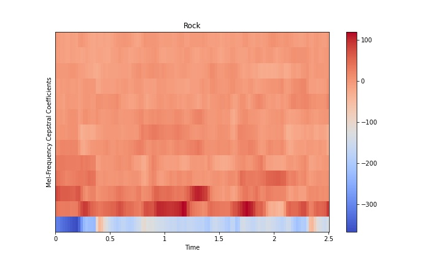

# Music Genre Classification

This repository contains the code for a music genre classifier written in Python using Tensorflow and Flask. 
You can try it out for yourself on [Heroku](https://music-clf.herokuapp.com/), though be warned that it might 
fail for large files due to the computational limits of Heroku.

This project was inspired by the [FMA dataset](https://github.com/mdeff/fma), though due to 
technical issues with this dataset I decided to instead use the [GTZAN](http://marsyas.info/downloads/datasets.html) dataset.

The model works by starting with a song and splitting it up into ten small chunks. Each chunk is then processed by extracting mel-frequency cepstral coefficients (MFCCs) over many tiny segments, producing an image like the one below:

The genre is then predicted using a convolutional neural network, a typical architecture suitable for image-like data such as this.

# Usage

Follow these steps if you wish to try out the code on your own machine.

## Environment Setup

Install the prerequisites by creating a new anaconda environment:

	conda env create -f environment.yml
	conda activate genre_rec

## Start the Flask server

If you want to test the server functionality with just a local flask server, follow these steps. Run the server:

	python app.py

Then visit `localhost:5000` in your web browser.

## Model Creation

If you wish to recreate the training process, first download the GTZAN dataset and refer to the steps below.

### Preprocessing

Once you have downloaded the GTZAN dataset, run the preprocessing script:

	python classifier/preprocess.py

This script will extract MFCCs (mel-frequency cepstral coefficients) from the `.wav` files and store the 
data and labels in a `.json` file.

### Training

You can view available models to train in the `models.py` file.
Currently there is logistic regression and a convolutional neural network avialable to train.
Modify the model creation section in `train.py` and run

	python classifier/train.py

which will give you a model summary, training information, and evaluation diagnostics. 

# Roadmap

- [x] Refactor code into scripts
- [x] Get Flask server working
- [x] Ping server with client
- [x] Deploy to Heroku
